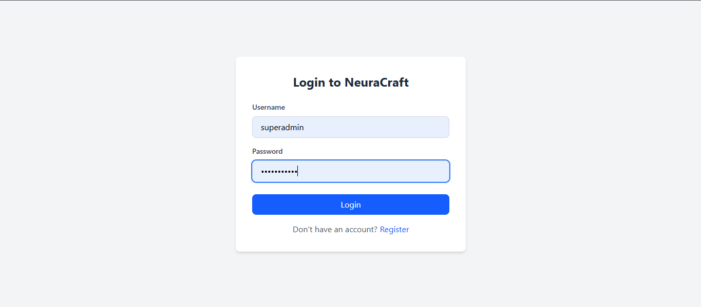
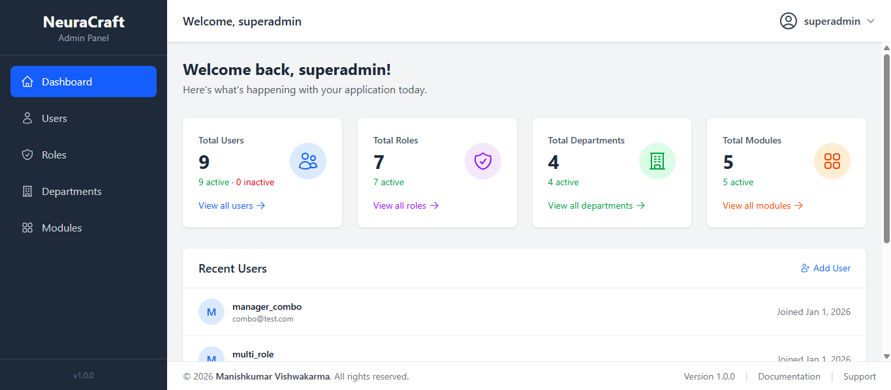
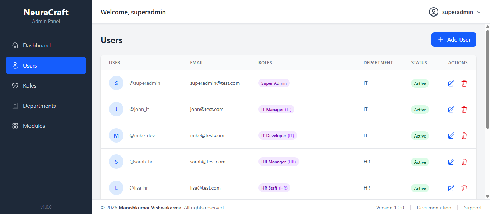
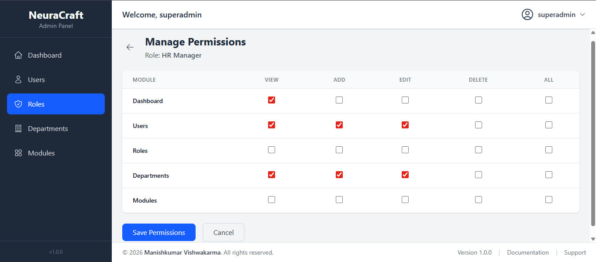

# NeuraCraft - Enterprise Admin Panel

<div align="center">
  <h3>🧠 NeuraCraft</h3>
  <p><strong>AI-Assisted Enterprise Role-Based Access Control Admin Panel</strong></p>
  <p>Built with React, TypeScript, Django REST Framework</p>
  
  
  
  
  
  
</div>

---

## 📖 About

**NeuraCraft** is a production-ready enterprise admin panel featuring a sophisticated role-based access control (RBAC) system. It demonstrates modern full-stack development practices with a clean, modular architecture.

### 🌟 Why "NeuraCraft"?
- **Neura** - Neural/AI: This project was collaboratively built with AI assistance
- **Craft** - Inspired by Vishwakarma (divine craftsman): Representing careful craftsmanship in code

### 👨‍💻 Creator
**Manish Kumar Vishwakarma** - Project Founder & Developer

---

## ✨ Features

### 🔐 Authentication & Security
- JWT-based authentication (Access + Refresh tokens)
- Token auto-refresh mechanism
- Secure logout with token blacklisting

### 👥 User Management
- Complete CRUD operations for users
- Multiple roles per user support
- Department assignment
- Active/Inactive status management

### 🛡️ Role-Based Access Control (RBAC)
- **Department-specific roles** - Same role name, different departments (e.g., "Manager" in Sales vs HR)
- **Multiple roles per user** - Users can have multiple roles with merged permissions
- **Granular permissions** - View, Add, Edit, Delete per module
- **OR logic permission merging** - If ANY role has permission, user gets it
- **Dynamic sidebar** - Shows only permitted modules

### 📦 Module Management
- Parent-child module hierarchy
- Dynamic menu generation
- Icon and path configuration
- Order-based sorting

### 🏢 Department Management
- Department CRUD operations
- Department code support
- Link roles to departments

### 📊 Dashboard
- Statistics overview
- Recent users display
- Quick access cards

### 🎨 UI/UX
- Clean, modern interface with Tailwind CSS
- Fixed header, sidebar, and footer
- Independent scroll areas
- Responsive design
- Loading states and error handling

---

## 🏗️ Tech Stack

### Backend
| Technology | Purpose |
|------------|---------|
| Python 3.13+ | Programming Language |
| Django 5.0+ | Web Framework |
| Django REST Framework | API Development |
| SimpleJWT | JWT Authentication |
| SQLite | Database (Development) |

### Frontend
| Technology | Purpose |
|------------|---------|
| React 18 | UI Library |
| TypeScript | Type Safety |
| Vite | Build Tool |
| Tailwind CSS | Styling |
| Zustand | State Management |
| Axios | HTTP Client |
| React Router | Routing |
| Heroicons | Icons |

---

## 📁 Project Structure
```
neuracraft/
├── base_template/              # Django Backend
│   ├── apps/
│   │   ├── users/              # User management & auth
│   │   ├── roles/              # Role & permissions
│   │   ├── departments/        # Department management
│   │   └── modules/            # Module & menu management
│   ├── core/
│   │   ├── settings.py
│   │   └── urls.py
│   └── manage.py
│
├── front_template/             # React Frontend
│   ├── src/
│   │   ├── api/                # Axios configuration
│   │   ├── auth/               # Authentication pages
│   │   ├── components/         # Shared components
│   │   ├── hooks/              # Custom hooks
│   │   ├── layouts/            # Page layouts
│   │   ├── modules/            # Feature modules
│   │   │   ├── dashboard/
│   │   │   ├── users/
│   │   │   ├── roles/
│   │   │   ├── departments/
│   │   │   └── modules/
│   │   ├── routes/             # Route configuration
│   │   ├── store/              # Zustand store
│   │   ├── types/              # TypeScript interfaces
│   │   └── utils/              # Utility functions
│   └── package.json
│
├── .gitignore
└── README.md
```

---

## 🚀 Getting Started

### Prerequisites
- Python 3.13+
- Node.js 18+
- npm or yarn

### Backend Setup
```bash
# Navigate to backend
cd base_template

# Create virtual environment
python -m venv venv

# Activate virtual environment
# Windows
venv\Scripts\activate
# Mac/Linux
source venv/bin/activate

# Install dependencies
pip install django djangorestframework djangorestframework-simplejwt django-cors-headers

# Run migrations
python manage.py makemigrations
python manage.py migrate

# Create superuser
python manage.py createsuperuser

# Start server
python manage.py runserver
```

### Frontend Setup
```bash
# Navigate to frontend
cd front_template

# Install dependencies
npm install

# Start development server
npm run dev
```

### Access the Application
- **Frontend**: http://localhost:5173
- **Backend API**: http://127.0.0.1:8000/api/
- **Django Admin**: http://127.0.0.1:8000/admin/

---

## 📡 API Endpoints

### Authentication
| Method | Endpoint | Description |
|--------|----------|-------------|
| POST | `/api/users/login/` | JWT Login |
| POST | `/api/users/register/` | User Registration |
| POST | `/api/users/logout/` | Logout (blacklist token) |
| POST | `/api/users/token/refresh/` | Refresh JWT token |
| GET | `/api/users/profile/` | Get current user profile |

### Users
| Method | Endpoint | Description |
|--------|----------|-------------|
| GET | `/api/users/` | List all users |
| GET | `/api/users/<id>/` | Get user details |
| PUT | `/api/users/<id>/` | Update user |
| DELETE | `/api/users/<id>/` | Delete user |

### Roles
| Method | Endpoint | Description |
|--------|----------|-------------|
| GET | `/api/roles/` | List all roles |
| POST | `/api/roles/` | Create role |
| GET | `/api/roles/<id>/` | Get role details |
| PUT | `/api/roles/<id>/` | Update role |
| DELETE | `/api/roles/<id>/` | Delete role |
| GET | `/api/roles/<id>/permissions/` | Get role permissions |
| POST | `/api/roles/<id>/permissions/` | Update role permissions |

### Departments
| Method | Endpoint | Description |
|--------|----------|-------------|
| GET | `/api/departments/` | List all departments |
| POST | `/api/departments/` | Create department |
| GET | `/api/departments/<id>/` | Get department details |
| PUT | `/api/departments/<id>/` | Update department |
| DELETE | `/api/departments/<id>/` | Delete department |

### Modules
| Method | Endpoint | Description |
|--------|----------|-------------|
| GET | `/api/modules/` | List all modules |
| POST | `/api/modules/` | Create module |
| GET | `/api/modules/<id>/` | Get module details |
| PUT | `/api/modules/<id>/` | Update module |
| DELETE | `/api/modules/<id>/` | Delete module |
| GET | `/api/modules/my-menu/` | Get user's dynamic menu |

### Dashboard
| Method | Endpoint | Description |
|--------|----------|-------------|
| GET | `/api/dashboard/stats/` | Get dashboard statistics |

---

## 🔐 Permission System

### How It Works

1. **Create Departments** (IT, HR, Sales, etc.)
2. **Create Roles** with optional department link
3. **Assign Module Permissions** to roles (View, Add, Edit, Delete)
4. **Assign Roles to Users** (multiple roles supported)
5. **Permissions Merge** automatically using OR logic

### Permission Merging Example
```
User: John
├── Role 1: IT Developer
│   └── Users Module: View ✅, Add ❌, Edit ❌, Delete ❌
├── Role 2: Team Lead
│   └── Users Module: View ✅, Add ✅, Edit ✅, Delete ❌
│
└── Final Permissions (OR merged):
    └── Users Module: View ✅, Add ✅, Edit ✅, Delete ❌
```

### Department-Specific Roles
```
Role: "Manager"
├── Department: Sales → Can access Sales Reports, Clients
├── Department: HR → Can access Employee Records, Payroll
└── Department: None (Global) → Access based on assigned modules
```

---

## 🧪 Test Users

Use these credentials to test different access levels:

| Username | Password | Roles | Access Level |
|----------|----------|-------|--------------|
| superadmin | Admin@123 | Super Admin | Full access |
| john_it | Test@123 | IT Manager | IT modules |
| viewer1 | Test@123 | Viewer | Read-only |
| multi_role | Test@123 | Developer + HR Staff | Merged access |

---

## 📸 Screenshots

<details>
<summary>Click to view screenshots</summary>

### Login Page


### Dashboard


### Users List


### Role Permissions


</details>

---

## 🛣️ Roadmap

- [ ] Password reset via email
- [ ] User profile page
- [ ] Dark mode toggle
- [ ] Pagination for lists
- [ ] Search and filter functionality
- [ ] Audit logs
- [ ] Export to CSV/Excel
- [ ] PostgreSQL support
- [ ] Docker containerization
- [ ] Unit tests

---

## 🤝 Contributing

Contributions are welcome! Please feel free to submit a Pull Request.

1. Fork the repository
2. Create your feature branch (`git checkout -b feature/AmazingFeature`)
3. Commit your changes (`git commit -m 'Add some AmazingFeature'`)
4. Push to the branch (`git push origin feature/AmazingFeature`)
5. Open a Pull Request

---

## 🙏 Acknowledgments

- **Manish Kumar Vishwakarma** - Project Founder & Developer
- AI Development Assistant
- [Django](https://www.djangoproject.com/) - Backend Framework
- [React](https://reactjs.org/) - Frontend Library
- [Tailwind CSS](https://tailwindcss.com/) - CSS Framework
- [Heroicons](https://heroicons.com/) - Icons

---

<div align="center">
  <p>Made with ❤️ and 🤖 AI</p>
  <p><strong>NeuraCraft</strong> - Crafted with Neural Intelligence</p>
</div>